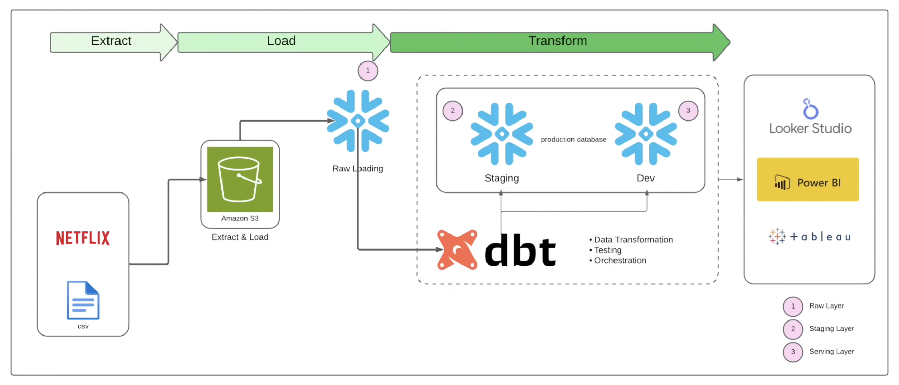
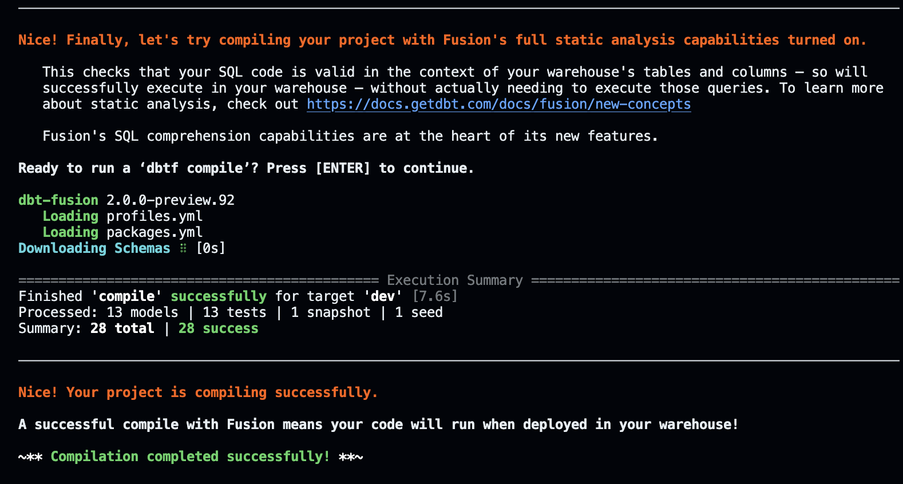
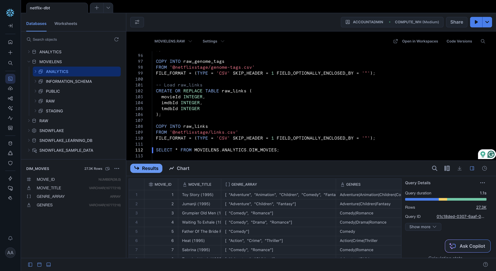

# Modern Data Modeling with dbt on Snowflake

---

## Overview

This project implements a complete **End-to-End ELT Pipeline** using the **Modern Data Stack**: **Snowflake** as the cloud data warehouse and **dbt (data build tool)** for transformation. The system automates the processing of movie and rating data (MovieLens dataset) from raw ingestion to a polished dimensional model (Star Schema) ready for advanced analytics and BI reporting.

The project demonstrates best practices in data engineering, including layered warehouse architecture, automated testing, and declarative transformation logic—all orchestrated through dbt.

---

## Project Goals

1.  **Cloud Data Warehousing**
    Leverage **Snowflake's** elastic compute and storage to manage large-scale movie datasets efficiently.

2.  **Modular Data Modeling**
    Implement a multi-layered architecture (Raw → Staging → Analytics) to ensure data quality and maintainability.

3.  **ELT Orchestration**
    Use **dbt** to transform raw data into optimized fact and dimension tables using SQL-based modeling.

4.  **Schema Evolution & Type Safety**
    Standardize raw JSON/CSV inputs into typed, structured tables with consistent naming conventions.

5.  **Automated Quality Assurance**
    Integrate dbt tests to ensure referential integrity, null constraints, and uniqueness across the pipeline.

6.  **Interactive Analytics**
    Prepare data for BI tools like **Power BI**, **Looker Studio**, and **Tableau** to visualize movie trends and user preferences.

---

## Tech Stack

| Technology                                                                                                     | Purpose                                                        |
| :------------------------------------------------------------------------------------------------------------- | :------------------------------------------------------------- |
|  | Cloud Data Warehouse for storage and high-performance compute. |
|                    | Transformation tool for modular SQL modeling and testing.      |
|             | Primary language for data transformations and modeling.        |
|                 | Configuration for dbt models, sources, and tests.              |
|    | External stage for initial data ingestion (Extraction Layer).  |

---

## Architecture Diagram



### Architecture Components

-   **Extraction & Loading**: Raw data (Netflix/MovieLens CSVs) is extracted and loaded into **Amazon S3**, which serves as an external stage for Snowflake.
-   **Raw Layer (Snowflake)**: Initial landing zone where data is loaded into `MOVIELENS.RAW`.
-   **Staging Layer (dbt)**: Cleansing, casting, and renaming raw data to prepare for modeling.
-   **Analytics Layer (dbt)**: Final Star Schema consisting of Dimension and Fact tables stored in `MOVIELENS.ANALYTICS`.
-   **Consumption Layer**: Structured data is queried by BI tools (Looker, Power BI, Tableau) for dashboarding.

---

## Dataset

-   **Source**: [MovieLens 25M Dataset](https://grouplens.org/datasets/movielens/)
-   **Description**: A comprehensive dataset containing over 25 million ratings and one million tag applications applied to 62,000 movies by 162,000 users.
-   **Tables**:
    -   `movies`, `ratings`, `tags`, `links`, `genome_scores`, `genome_tags`
-   **Use Case**: Analyze user rating behavior, movie popularity, and genre trends over time.

### Data Modeling: Raw to Dimensional

The transformation follows a modular approach to convert normalized raw files into an analytics-ready schema:

**Transformation Flow:**

1.  **Staging (`src_*`)**: Primary cleaning of the raw tables.
2.  **Dimension Tables**: `dim_movies`, `dim_users`, `dim_genome_tags`, `dim_movies_tags`.
3.  **Fact Tables**: `fact_ratings`, `fact_genome_scores`.
4.  **Marts**: `mart_movie_release_dates` (aggregations for high-level insights).

---

## Project Structure

```text
netflix/
├── models/
│   ├── staging/            # Staging models (src_*) for raw data cleansing
│   ├── dim/                # Dimension tables (SCD, descriptive attributes)
│   ├── fact/               # Fact tables (Events, measurements)
│   ├── marts/              # Business-facing aggregate models
│   ├── schema.yml          # Documentation and tests for models
│   └── sources.yml         # Source definitions for Snowflake RAW layer
├── seeds/                  # Static data loaded via dbt seed
├── macros/                 # Reusable Jinja macros
├── snapshots/              # Snapshot configurations for historical tracking
├── tests/                  # Custom data quality tests
├── dbt_project.yml         # Core dbt configuration
└── profiles.yml            # (Local) Snowflake connection settings
```

---

## ELT Workflow

The dbt pipeline executes the following sequence:

### 1. **Data Ingestion**

Data is loaded into Snowflake using `COPY INTO` commands from S3 or local files into the `RAW` schema.

### 2. **Staging & Cleansing**

-   Casting timestamps from Unix to readable formats.
-   Extracting release years from movie titles using regex.
-   Standardizing column names (snake_case).

### 3. **Dimensional Modeling**

-   **`dim_movies`**: Cleansed movie metadata with genre arrays.
-   **`dim_users`**: Unique user registry derived from interaction tables.
-   **`fact_ratings`**: Transactional grain of user scores for movies.

### 4. **Testing & Documentation**

-   **Schema Tests**: Ensuring `movie_id` and `user_id` are `not_null` and `unique`.
-   **Relationship Tests**: Validating referential integrity between Fact and Dimension tables.

---

## Setup & Installation

### Prerequisites

-   **Snowflake Account**: Trial or active account.
-   **dbt Cloud or dbt Core**: Version 1.5+.
-   **Python 3.8+**: If using dbt Core.

### 1. Clone the Repository

```bash
git clone https://github.com/asadali27232/dbt-snowflake-elt-project.git
cd dbt-snowflake-elt-project/netflix
```

### 2. Configure dbt Profile

Ensure your `~/.dbt/profiles.yml` matches your Snowflake credentials:

```yaml
netflix:
    target: dev
    outputs:
        dev:
            type: snowflake
            account: <your_account_locator>
            user: <your_username>
            password: <your_password>
            role: ACCOUNTADMIN
            database: MOVIELENS
            warehouse: COMPUTE_WH
            schema: ANALYTICS
```

### 3. Install Dependencies

```bash
dbt deps
```

### 4. Initialize Data (Seeds)

Load any static lookup data from CSVs:

```bash
dbt seed
```

### 5. Build the Pipeline

Run the entire transformation pipeline:

```bash
dbt build
```

_Note: `dbt build` runs `dbt run`, `dbt test`, `dbt snapshot`, and `dbt seed` in the correct dependency order._

---

## Querying Data in Snowflake

Once the pipeline completes, you can query the analytics-ready tables:

### Example Queries

**1. Top 10 Highest Rated Movies:**

```sql
SELECT
    m.movie_title,
    AVG(r.rating) as avg_rating,
    COUNT(*) as total_ratings
FROM ANALYTICS.FACT_RATINGS r
JOIN ANALYTICS.DIM_MOVIES m ON r.movie_id = m.movie_id
GROUP BY 1
HAVING total_ratings > 1000
ORDER BY avg_rating DESC
LIMIT 10;
```

**2. Distribution of Movies by Genre:**

```sql
SELECT
    VALUE::STRING as genre,
    COUNT(*) as movie_count
FROM ANALYTICS.DIM_MOVIES,
LATERAL FLATTEN(INPUT => GENRE_ARRAY)
GROUP BY 1
ORDER BY 2 DESC;
```

---

## Documentation & Lineage

dbt automatically generates documentation and visual lineage for the entire project:

```bash
dbt docs generate
dbt docs serve
```

### Workflow Execution Summary



### Data Validation in Snowflake



---

## Let's Connect

[](https://wa.me/923074315952)
[](mailto:asadali27232@gmail.com)
[](https://www.linkedin.com/in/asadali27232/)
[](https://github.com/asadali27232)
[](https://www.facebook.com/asadalighaffar)
[](https://twitter.com/asadali27232)
[](https://asadali27232.github.io/asadali27232)
